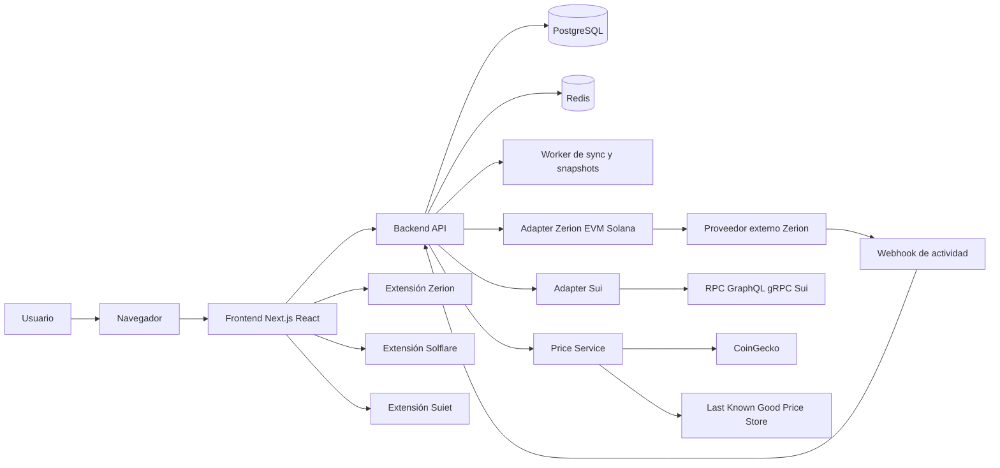
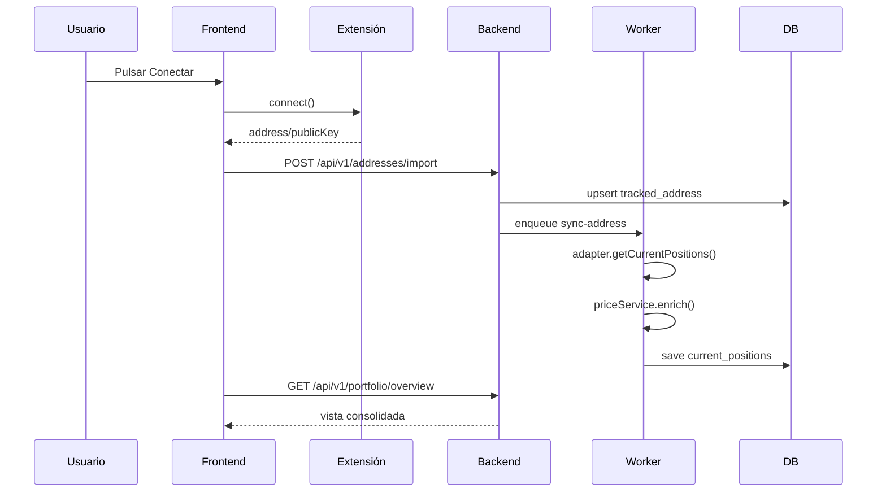
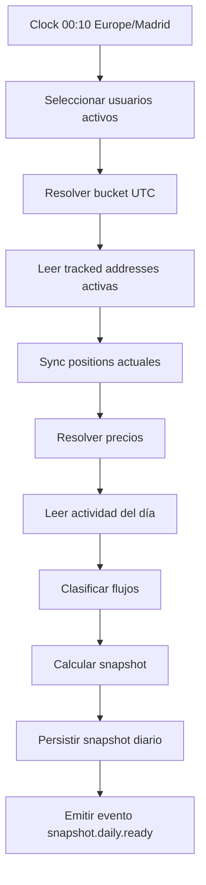
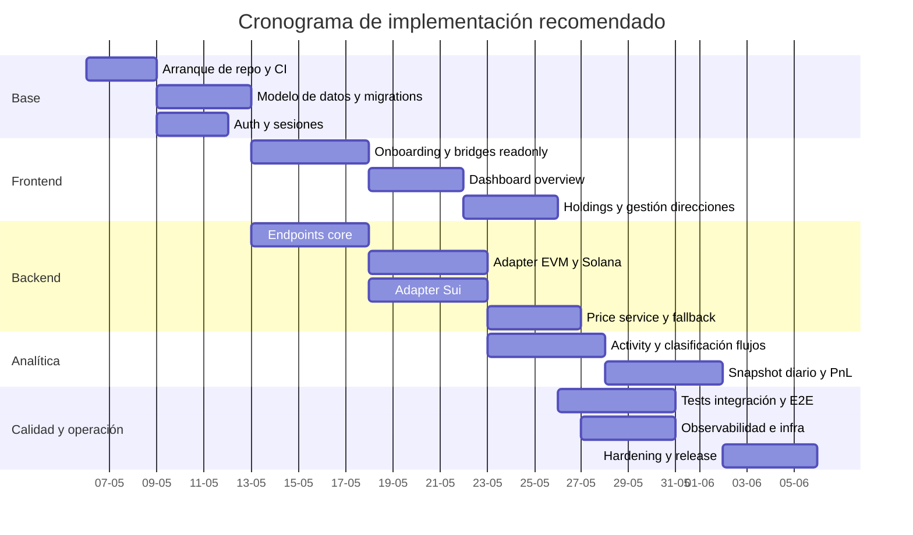

# Documento técnico integral para una web de portfolio cripto en modo solo lectura

## Resumen ejecutivo

La solución propuesta es una **aplicación web de agregación de carteras en modo solo lectura** que permite conectar direcciones obtenidas desde Zerion, Solflare y Suiet, consolidarlas en una cuenta de usuario, valorarlas con una capa de precios unificada y generar un histórico diario de patrimonio y PnL. El sistema **no firma mensajes**, **no firma transacciones**, **no envía transacciones** y **no custodia claves**. El rol de las extensiones es únicamente exponer direcciones públicas y notificar cambios de cuenta en el navegador.

La decisión arquitectónica principal es separar con claridad cuatro capas. La primera es la **capa de conexión de wallets** en frontend, que solo obtiene cuentas. La segunda es la **capa de adapters por ecosistema** en backend, que convierte cada fuente externa a un contrato interno estable. La tercera es la **capa de normalización y valoración**, que resuelve activos, metadatos, precios y reglas de consolidación. La cuarta es la **capa analítica**, que genera snapshots diarios, clasifica flujos y calcula PnL.

La única forma de cumplir el objetivo “sin consultar documentación externa” de forma robusta es diseñar el sistema alrededor de **contratos internos propios**. Por tanto, este documento especifica completamente esos contratos, los endpoints internos, el modelo de datos, el pipeline de sincronización, la lógica de snapshots y el cálculo del PnL. Cualquier detalle exacto de proveedores o SDKs que no pueda fijarse con seguridad en este documento se marca como **“no especificado en este documento”** y se encapsula detrás de interfaces internas para no bloquear el desarrollo.

La recomendación de alcance para el MVP es clara. Debe cubrir **activos fungibles**, **valor total**, **breakdown por dirección y por ecosistema**, **snapshot diario**, **curva histórica** y **PnL ajustado por flujos externos**. Debe dejar fuera, en la primera versión, NFTs, LPs complejas, staking no fungible, derivados y cualquier posición cuya semántica económica no pueda determinarse con alta confianza. El diseño, sin embargo, deja preparado el sistema para ampliar soporte más adelante.

## Alcance, supuestos y decisiones de diseño

### Objetivo funcional

La aplicación debe permitir que un usuario:

1. Cree una cuenta en la aplicación.
2. Conecte Zerion, Solflare y Suiet desde el navegador en modo lectura.
3. Importe una o varias direcciones por ecosistema.
4. Visualice el valor total consolidado de todas sus direcciones.
5. Visualice holdings agregados y desglosados por dirección.
6. Consulte una serie temporal diaria de patrimonio.
7. Consulte PnL diario y acumulado ajustado por aportaciones y retiradas externas.
8. Gestione direcciones múltiples, etiquetas, activación/desactivación y resync manual.
9. Reciba una UX explícita de “solo lectura” sin prompts de firma.

### Alcance técnico

El sistema debe proporcionar:

- Frontend web con Next.js y React.
- Backend HTTP/JSON.
- Worker asíncrono para sync y snapshots.
- Base de datos relacional.
- Caché y colas.
- Capa de precios con CoinGecko como fuente primaria y fallback interno.
- Observabilidad, alertas y runbooks.
- Infraestructura declarativa.
- Tests unitarios, de integración y end-to-end.

### Fuera de alcance del MVP

Quedan fuera del primer corte:

- Ejecución de swaps, bridges o staking.
- Firma de mensajes o SIWE.
- Gestión de NFTs.
- Cálculo fiscal por lotes completo.
- Reconciliación bancaria o con exchanges centralizados.
- Soporte oficial a testnets.
- Multiusuario compartiendo una misma cartera.
- Móvil nativo.

### Supuestos operativos

Este diseño parte de los siguientes supuestos:

- La base de valuación interna se hará en **USD**. La presentación en EUR se puede añadir más tarde mediante una capa FX separada. Fuente FX exacta: **no especificado en este documento**.
- Las extensiones se usan únicamente para leer direcciones. Si una extensión requiere un prompt de conexión, eso se considera aceptable; cualquier prompt de firma se considera prohibido.
- La unidad principal de consolidación es la **dirección pública**, no la marca de la wallet.
- Los precios pueden llegar por dos rutas: fuente primaria de precios y valoraciones proporcionadas por adapters externos. La política de precedencia la fija este documento.
- Cuando un protocolo concreto no permita conocer con certeza la naturaleza económica de una operación, esa operación se marca como `UNKNOWN` y no se neutraliza automáticamente hasta revisión o heurística suficiente.

### Comparativa de proveedores y responsabilidades

| Componente | Rol en la solución | Ecosistema | Qué aporta | Qué no debe aportar | Coste | Límites |
|---|---|---:|---|---|---|---|
| Zerion | Fuente de conexión EVM y adapter de portfolio EVM/Solana | EVM / Solana | Dirección pública, posiciones, histórico, actividad | Firma, envío, custodiar claves | no especificado en este documento | no especificado en este documento |
| Solflare | Fuente de conexión Solana | Solana | Public key y cambio de cuenta | Valuación consolidada global | n/a extensión local | n/a |
| Suiet | Fuente de conexión Sui | Sui | Dirección Sui y cambio de cuenta | Históricos y pricing fiat | n/a extensión local | n/a |
| entity["company","CoinGecko","crypto data provider"] | Capa primaria de precios | Multicadena | Precio spot/histórico y metadatos útiles | Conectar wallets | no especificado en este documento | no especificado en este documento |
| Fallback interno | Capa de resiliencia | Multicadena | Último precio válido y valoración del adapter | Sustituir por completo a la fuente primaria a largo plazo | coste interno | límites internos |

### Requisitos no funcionales

| Área | Objetivo |
|---|---|
| Seguridad | Nunca pedir firmas ni transacciones. Secretos solo en backend. |
| Rendimiento | `GET /portfolio/overview` p95 < 500 ms con caché caliente. |
| Frescura | Vista consolidada con desfase objetivo ≤ 5 minutos salvo degradación. |
| Consistencia | Snapshots diarios inmutables una vez cerrados. |
| Disponibilidad | 99.5% objetivo en producción para lectura. |
| Auditabilidad | Toda reclasificación manual de flujos debe dejar rastro. |
| Escalabilidad | Soportar miles de usuarios y decenas de direcciones por usuario sin rediseño. |
| Observabilidad | Trazas, métricas, logs estructurados y alertas accionables. |

## Arquitectura de referencia

### Arquitectura lógica



### Principios de diseño

El diseño sigue seis principios:

**Aislamiento de proveedores.** Ninguna pantalla del frontend ni ningún endpoint de negocio depende del shape de un proveedor externo. Todo upstream se transforma a DTOs internos.

**Read-only estricto.** La interfaz de conexión de wallets expone únicamente `connect`, `disconnect`, `getAccounts` y eventos de cambio. No existe ningún método interno de firma.

**Normalización fuerte.** Tanto direcciones como activos se canonicalizan desde el primer momento para evitar duplicidades, colisiones de símbolos o mezclas entre redes.

**Snapshots como fuente de verdad analítica.** La UI en tiempo real usa posiciones actuales; la analítica histórica usa snapshots diarios cerrados.

**Tolerancia a degradación.** Si un proveedor externo falla, la aplicación puede seguir funcionando con caché, último precio válido y estado “stale”.

**Reclasificación humana controlada.** La neutralización automática de transferencias internas usa heurísticas, pero cualquier caso dudoso debe poder corregirse manualmente.

### Topología de repositorio

```text
repo/
  apps/
    web/
      app/
      components/
      features/
      lib/
      styles/
    api/
      src/
        modules/
          auth/
          addresses/
          portfolio/
          pnl/
          pricing/
          sync/
          health/
          webhooks/
        middleware/
        dto/
        errors/
    worker/
      src/
        jobs/
          sync-address.job.ts
          snapshot-daily.job.ts
          retry-stale-prices.job.ts
          reclassify-flows.job.ts
  packages/
    domain/
      src/
        contracts/
        value-objects/
        enums/
        math/
    adapters/
      src/
        evm-zerion/
        solana-zerion/
        sui-native/
        pricing-coingecko/
    ui/
      src/
    config/
      src/
  prisma/
    schema.prisma
    migrations/
  infra/
    terraform/
      envs/
      modules/
  docker/
  scripts/
```

### Contratos internos principales

```ts
export type Ecosystem = 'evm' | 'solana' | 'sui';
export type WalletSource = 'zerion' | 'solflare' | 'suiet';
export type ChainRef = `eip155:${number}` | 'solana:mainnet' | 'sui:mainnet';

export interface ConnectedAccount {
  ecosystem: Ecosystem;
  walletSource: WalletSource;
  address: string;
  chainRef: ChainRef;
  labelHint?: string;
}

export type WalletBridgeEvent =
  | { type: 'accountsChanged'; accounts: ConnectedAccount[] }
  | { type: 'disconnect' }
  | { type: 'providerUnavailable' };

export interface ReadOnlyWalletBridge {
  source: WalletSource;
  ecosystem: Ecosystem;
  isInstalled(): boolean;
  connect(): Promise<ConnectedAccount[]>;
  getAccounts(): Promise<ConnectedAccount[]>;
  onEvent(cb: (event: WalletBridgeEvent) => void): () => void;
  disconnect(): Promise<void>;
}

export interface CanonicalAssetRef {
  canonicalKey: string;      // ej. evm:eip155:1:0xa0b8..., solana:mint:..., sui:coin:...
  ecosystem: Ecosystem;
  chainRef: ChainRef;
  contractRef: string | null;
  symbol: string | null;
  name: string | null;
  decimals: number | null;
}

export interface NormalizedPosition {
  asset: CanonicalAssetRef;
  quantity: string;          // decimal string
  priceUsd: string | null;   // decimal string
  valueUsd: string | null;   // decimal string
  priceSource: 'coingecko' | 'adapter' | 'last_known_good' | 'none';
  priceAsOf: string | null;  // ISO datetime
  warnings: string[];
}

export interface NormalizedActivity {
  externalId: string;
  occurredAt: string;
  direction: 'in' | 'out' | 'self' | 'unknown';
  kind:
    | 'transfer'
    | 'swap'
    | 'bridge'
    | 'fee'
    | 'reward'
    | 'airdrop'
    | 'stake'
    | 'unstake'
    | 'unknown';
  assetIn?: { assetKey: string; quantity: string };
  assetOut?: { assetKey: string; quantity: string };
  feeUsd?: string | null;
  txHash?: string | null;
  fromAddress?: string | null;
  toAddress?: string | null;
  metadata?: Record<string, unknown>;
}

export interface PortfolioAdapter {
  supportsHistory: boolean;
  supportsActivity: boolean;
  getCurrentPositions(address: string, chainRef: ChainRef): Promise<NormalizedPosition[]>;
  getActivity(address: string, chainRef: ChainRef, from: string, to: string): Promise<NormalizedActivity[]>;
  getHistoricalNetWorth(
    address: string,
    chainRef: ChainRef,
    from: string,
    to: string
  ): Promise<Array<{ at: string; valueUsd: string }> | null>;
}
```

### Diagrama de flujo de conexión y sincronización



### Dependencias y versiones recomendadas

Las versiones concretas de terceros pueden variar. Donde la versión exacta no esté fijada con seguridad, se recomienda **rango mayor estable compatible** y congelación vía lockfile.

| Dependencia | Versión objetivo | Uso |
|---|---:|---|
| Node.js | 22 LTS | Runtime backend y tooling |
| TypeScript | 5.8+ | Tipado |
| pnpm | 10+ | Gestión de paquetes |
| Next.js | 15.x | Frontend y routing |
| React | 19.x | UI |
| TanStack Query | 5.x | Server state en frontend |
| Zustand | 5.x | Estado efímero de conexión y UI |
| Tailwind CSS | 4.x | Estilos |
| Zod | 3.x | Validación DTO |
| Prisma | 6.x | ORM y migrations |
| PostgreSQL | 16 | Persistencia |
| Redis | 7.2+ | Caché, locks y colas |
| BullMQ | 5.x | Jobs |
| Decimal.js | 10.x | Aritmética exacta |
| Pino | 9.x | Logging |
| OpenTelemetry | 1.x | Trazas y métricas |
| Vitest | 2.x | Test unitario |
| Playwright | 1.5x | E2E |
| Docker | 27+ | Desarrollo y despliegue |
| Terraform | 1.9+ | Infra como código |
| wagmi | 2.x | Bridge EVM en frontend |
| viem | 2.x | Cliente EVM read-only |
| Solana wallet adapter | rango estable compatible | Bridge Solana |
| Sui dApp Kit | rango estable compatible | Bridge Sui |

Si una librería concreta de wallet o SDK no ofrece una versión clara en tu entorno, la regla es: **pin a la última versión estable que no rompa el contrato interno** y bloquearla en lockfile. El backend nunca debe quedar atado al shape errático de una dependencia de UI.

## Especificación backend y modelo de datos

### Convenciones de API interna

La API interna será JSON sobre HTTPS, con versión en path y envelope homogéneo.

**Formato de éxito**

```json
{
  "data": {},
  "meta": {
    "requestId": "req_01JXYZ",
    "servedAt": "2026-05-05T10:30:00.000Z"
  }
}
```

**Formato de error**

```json
{
  "error": {
    "code": "UPSTREAM_RATE_LIMITED",
    "message": "El proveedor externo ha aplicado rate limit",
    "retryAfterSec": 30,
    "requestId": "req_01JXYZ"
  }
}
```

### Códigos de error internos

| Código | HTTP | Reintentable | Significado |
|---|---:|---:|---|
| `VALIDATION_ERROR` | 400 | No | Input inválido |
| `UNAUTHORIZED` | 401 | No | Sesión inválida |
| `FORBIDDEN` | 403 | No | Recurso ajeno |
| `NOT_FOUND` | 404 | No | Recurso inexistente |
| `CONFLICT` | 409 | No | Duplicado o estado incompatible |
| `WALLET_PROVIDER_UNAVAILABLE` | 409 | Sí | Extensión no disponible en UI o no accesible |
| `WALLET_USER_REJECTED` | 409 | No | Usuario canceló la conexión |
| `UPSTREAM_TEMPORARY` | 503 | Sí | Error temporal del proveedor |
| `UPSTREAM_RATE_LIMITED` | 503 | Sí | Rate limit upstream |
| `PRICE_NOT_FOUND` | 200 | No | Sin precio, con warning |
| `SNAPSHOT_NOT_READY` | 409 | Sí | Snapshot en proceso |
| `INTERNAL_ERROR` | 500 | Sí | Error interno inesperado |

### Catálogo de endpoints

| Método | Path | Descripción |
|---|---|---|
| `POST` | `/api/v1/auth/passkeys/register/options` | Inicio de registro con passkeys |
| `POST` | `/api/v1/auth/passkeys/register/verify` | Verificación de registro |
| `POST` | `/api/v1/auth/passkeys/login/options` | Inicio de login |
| `POST` | `/api/v1/auth/passkeys/login/verify` | Verificación de login |
| `GET` | `/api/v1/me` | Usuario actual |
| `POST` | `/api/v1/addresses/import` | Importar dirección desde wallet o manual |
| `GET` | `/api/v1/addresses` | Listar direcciones del usuario |
| `PATCH` | `/api/v1/addresses/:id` | Editar etiqueta, flags o visibilidad |
| `DELETE` | `/api/v1/addresses/:id` | Desactivar dirección |
| `POST` | `/api/v1/addresses/:id/sync` | Lanzar sync manual |
| `GET` | `/api/v1/sync-jobs/:id` | Estado de job |
| `GET` | `/api/v1/portfolio/overview` | KPIs y consolidado actual |
| `GET` | `/api/v1/portfolio/holdings` | Holdings normalizados |
| `GET` | `/api/v1/portfolio/timeseries` | Serie histórica |
| `GET` | `/api/v1/pnl/summary` | Resumen de PnL |
| `GET` | `/api/v1/pnl/daily` | PnL por día |
| `GET` | `/api/v1/activity` | Actividad consolidada |
| `POST` | `/api/v1/flows/:id/reclassify` | Reclasificación manual |
| `GET` | `/api/v1/system/providers` | Estado de proveedores |
| `POST` | `/api/v1/webhooks/zerion` | Recepción de webhooks |
| `GET` | `/health/live` | Liveness |
| `GET` | `/health/ready` | Readiness |

### Endpoint de importación de dirección

**Request**

```json
{
  "ecosystem": "evm",
  "walletSource": "zerion",
  "address": "0x1234...abcd",
  "label": "Cuenta principal",
  "chainRef": "eip155:1",
  "importMode": "wallet_connect"
}
```

**Response**

```json
{
  "data": {
    "addressId": "addr_01JABC",
    "normalizedAddress": "0x1234...abcd",
    "syncJobId": "job_01JABD",
    "warnings": []
  },
  "meta": {
    "requestId": "req_01JABE",
    "servedAt": "2026-05-05T10:35:00.000Z"
  }
}
```

### Endpoint de overview

**Request**

`GET /api/v1/portfolio/overview?quoteCurrency=USD`

**Response**

```json
{
  "data": {
    "quoteCurrency": "USD",
    "asOf": "2026-05-05T10:35:00.000Z",
    "isStale": false,
    "totals": {
      "netWorth": "12450.34",
      "unpricedValue": "120.00",
      "pricedAssetCount": 18,
      "unpricedAssetCount": 2
    },
    "breakdownByEcosystem": [
      { "ecosystem": "evm", "value": "8420.34" },
      { "ecosystem": "solana", "value": "2740.00" },
      { "ecosystem": "sui", "value": "1290.00" }
    ],
    "breakdownByAddress": [
      { "addressId": "addr_1", "label": "Cuenta principal", "value": "5110.00" },
      { "addressId": "addr_2", "label": "Solana trading", "value": "2740.00" }
    ],
    "warnings": [
      {
        "code": "UNPRICED_ASSETS_PRESENT",
        "message": "Existen activos sin precio y no se incluyen en netWorth"
      }
    ]
  },
  "meta": {
    "requestId": "req_01JABF",
    "servedAt": "2026-05-05T10:35:01.000Z"
  }
}
```

### Endpoint de timeseries

**Request**

`GET /api/v1/portfolio/timeseries?from=2026-04-01&to=2026-05-05&metric=net_worth`

**Response**

```json
{
  "data": {
    "metric": "net_worth",
    "bucket": "day",
    "points": [
      { "date": "2026-04-01", "value": "11200.00", "stale": false },
      { "date": "2026-04-02", "value": "11340.20", "stale": false },
      { "date": "2026-04-03", "value": "11010.10", "stale": false }
    ]
  },
  "meta": {
    "requestId": "req_01JABG",
    "servedAt": "2026-05-05T10:35:02.000Z"
  }
}
```

### Endpoint de PnL diario

**Request**

`GET /api/v1/pnl/daily?from=2026-04-01&to=2026-05-05`

**Response**

```json
{
  "data": {
    "bucket": "day",
    "points": [
      {
        "date": "2026-04-01",
        "startNetWorth": "11000.00",
        "endNetWorth": "11200.00",
        "externalContributions": "100.00",
        "externalWithdrawals": "0.00",
        "internalTransfers": "250.00",
        "fees": "3.50",
        "pnlNet": "100.00"
      }
    ],
    "summary": {
      "pnlNetPeriod": "850.23",
      "contributionsPeriod": "3000.00",
      "withdrawalsPeriod": "1200.00"
    }
  },
  "meta": {
    "requestId": "req_01JABH",
    "servedAt": "2026-05-05T10:35:03.000Z"
  }
}
```

### Prisma schema de referencia

```prisma
generator client {
  provider = "prisma-client-js"
}

datasource db {
  provider = "postgresql"
  url      = env("DATABASE_URL")
}

enum Ecosystem {
  evm
  solana
  sui
}

enum WalletSource {
  zerion
  solflare
  suiet
}

enum AddressStatus {
  active
  inactive
  archived
}

enum SyncStatus {
  queued
  running
  succeeded
  failed
  partial
}

enum PriceSource {
  coingecko
  adapter
  last_known_good
  none
}

enum FlowClass {
  external_contribution
  external_withdrawal
  internal_transfer
  reward
  airdrop
  fee
  unknown
}

model User {
  id               String                @id @default(cuid())
  email            String?               @unique
  locale           String                @default("es-ES")
  timezone         String                @default("Europe/Madrid")
  createdAt        DateTime              @default(now())
  updatedAt        DateTime              @updatedAt
  trackedAddresses TrackedAddress[]
  dailySnapshots   PortfolioSnapshotDaily[]
  flowEvents       FlowEvent[]
  syncJobs         SyncJob[]
}

model TrackedAddress {
  id                 String            @id @default(cuid())
  userId             String
  ecosystem          Ecosystem
  walletSource       WalletSource
  chainRef           String
  addressRaw         String
  addressNormalized  String
  label              String?
  status             AddressStatus     @default(active)
  importedAt         DateTime          @default(now())
  lastSyncedAt       DateTime?
  lastSeenFromWallet DateTime?
  metadata           Json?
  user               User              @relation(fields: [userId], references: [id], onDelete: Cascade)
  currentPositions   CurrentPosition[]
  syncJobs           SyncJob[]

  @@unique([userId, ecosystem, addressNormalized])
  @@index([userId, status])
  @@index([ecosystem, chainRef])
}

model Asset {
  id               String            @id @default(cuid())
  canonicalKey     String            @unique
  ecosystem        Ecosystem
  chainRef         String
  contractRef      String?
  symbol           String?
  name             String?
  decimals         Int?
  metadata         Json?
  createdAt        DateTime          @default(now())
  updatedAt        DateTime          @updatedAt
  positions        CurrentPosition[]
  pricePoints      PricePoint[]
  flowEvents       FlowEvent[]

  @@index([ecosystem, chainRef])
  @@index([symbol])
}

model CurrentPosition {
  id               String       @id @default(cuid())
  trackedAddressId String
  assetId          String
  quantity         Decimal      @db.Decimal(38, 18)
  priceUsd         Decimal?     @db.Decimal(38, 18)
  valueUsd         Decimal?     @db.Decimal(38, 18)
  priceSource      PriceSource
  priceAsOf        DateTime?
  valuationAsOf    DateTime
  warnings         Json?
  trackedAddress   TrackedAddress @relation(fields: [trackedAddressId], references: [id], onDelete: Cascade)
  asset            Asset          @relation(fields: [assetId], references: [id], onDelete: Cascade)

  @@unique([trackedAddressId, assetId])
  @@index([trackedAddressId])
  @@index([assetId])
}

model PricePoint {
  id           String      @id @default(cuid())
  assetId      String
  quoteCurrency String     @default("USD")
  source       PriceSource
  quotedAt     DateTime
  price        Decimal     @db.Decimal(38, 18)
  metadata     Json?
  asset        Asset       @relation(fields: [assetId], references: [id], onDelete: Cascade)

  @@unique([assetId, quoteCurrency, source, quotedAt])
  @@index([assetId, quotedAt(sort: Desc)])
}

model PortfolioSnapshotDaily {
  id                    String   @id @default(cuid())
  userId                String
  day                   DateTime // medianoche lógica del usuario
  bucketStartUtc        DateTime
  bucketEndUtc          DateTime
  quoteCurrency         String   @default("USD")
  netWorth              Decimal  @db.Decimal(38, 18)
  unpricedValue         Decimal  @db.Decimal(38, 18)
  externalContributions Decimal  @db.Decimal(38, 18)
  externalWithdrawals   Decimal  @db.Decimal(38, 18)
  internalTransfers     Decimal  @db.Decimal(38, 18)
  fees                  Decimal  @db.Decimal(38, 18)
  pnlNet                Decimal  @db.Decimal(38, 18)
  breakdown             Json
  createdAt             DateTime @default(now())
  user                  User     @relation(fields: [userId], references: [id], onDelete: Cascade)

  @@unique([userId, day, quoteCurrency])
  @@index([userId, day(sort: Desc)])
}

model FlowEvent {
  id                 String    @id @default(cuid())
  userId             String
  trackedAddressId   String?
  assetId            String?
  occurredAt         DateTime
  txHash             String?
  externalId         String
  direction          String
  amount             Decimal?  @db.Decimal(38, 18)
  amountUsd          Decimal?  @db.Decimal(38, 18)
  feeUsd             Decimal?  @db.Decimal(38, 18)
  counterparty       String?
  flowClass          FlowClass
  internalGroupKey   String?
  confidence         Decimal?  @db.Decimal(5, 4)
  metadata           Json?
  createdAt          DateTime  @default(now())
  updatedAt          DateTime  @updatedAt
  user               User      @relation(fields: [userId], references: [id], onDelete: Cascade)
  trackedAddress     TrackedAddress? @relation(fields: [trackedAddressId], references: [id], onDelete: SetNull)
  asset              Asset?    @relation(fields: [assetId], references: [id], onDelete: SetNull)

  @@unique([userId, externalId])
  @@index([userId, occurredAt(sort: Desc)])
  @@index([internalGroupKey])
  @@index([txHash])
}

model SyncJob {
  id               String      @id @default(cuid())
  userId           String
  trackedAddressId String?
  jobType          String
  status           SyncStatus
  trigger          String
  attempts         Int         @default(0)
  startedAt        DateTime?
  finishedAt       DateTime?
  errorCode        String?
  errorMessage     String?
  metrics          Json?
  createdAt        DateTime    @default(now())
  updatedAt        DateTime    @updatedAt
  user             User        @relation(fields: [userId], references: [id], onDelete: Cascade)
  trackedAddress   TrackedAddress? @relation(fields: [trackedAddressId], references: [id], onDelete: SetNull)

  @@index([status, createdAt(sort: Desc)])
  @@index([userId, createdAt(sort: Desc)])
}
```

### Ejemplo de migración SQL

```sql
CREATE TYPE ecosystem AS ENUM ('evm', 'solana', 'sui');
CREATE TYPE wallet_source AS ENUM ('zerion', 'solflare', 'suiet');
CREATE TYPE address_status AS ENUM ('active', 'inactive', 'archived');
CREATE TYPE sync_status AS ENUM ('queued', 'running', 'succeeded', 'failed', 'partial');
CREATE TYPE price_source AS ENUM ('coingecko', 'adapter', 'last_known_good', 'none');
CREATE TYPE flow_class AS ENUM (
  'external_contribution',
  'external_withdrawal',
  'internal_transfer',
  'reward',
  'airdrop',
  'fee',
  'unknown'
);

CREATE TABLE users (
  id TEXT PRIMARY KEY,
  email TEXT UNIQUE,
  locale TEXT NOT NULL DEFAULT 'es-ES',
  timezone TEXT NOT NULL DEFAULT 'Europe/Madrid',
  created_at TIMESTAMPTZ NOT NULL DEFAULT now(),
  updated_at TIMESTAMPTZ NOT NULL DEFAULT now()
);

CREATE TABLE tracked_addresses (
  id TEXT PRIMARY KEY,
  user_id TEXT NOT NULL REFERENCES users(id) ON DELETE CASCADE,
  ecosystem ecosystem NOT NULL,
  wallet_source wallet_source NOT NULL,
  chain_ref TEXT NOT NULL,
  address_raw TEXT NOT NULL,
  address_normalized TEXT NOT NULL,
  label TEXT NULL,
  status address_status NOT NULL DEFAULT 'active',
  imported_at TIMESTAMPTZ NOT NULL DEFAULT now(),
  last_synced_at TIMESTAMPTZ NULL,
  metadata JSONB NULL,
  UNIQUE (user_id, ecosystem, address_normalized)
);

CREATE INDEX idx_tracked_addresses_user_status
  ON tracked_addresses(user_id, status);

CREATE TABLE assets (
  id TEXT PRIMARY KEY,
  canonical_key TEXT NOT NULL UNIQUE,
  ecosystem ecosystem NOT NULL,
  chain_ref TEXT NOT NULL,
  contract_ref TEXT NULL,
  symbol TEXT NULL,
  name TEXT NULL,
  decimals INT NULL,
  metadata JSONB NULL,
  created_at TIMESTAMPTZ NOT NULL DEFAULT now(),
  updated_at TIMESTAMPTZ NOT NULL DEFAULT now()
);

CREATE TABLE current_positions (
  id TEXT PRIMARY KEY,
  tracked_address_id TEXT NOT NULL REFERENCES tracked_addresses(id) ON DELETE CASCADE,
  asset_id TEXT NOT NULL REFERENCES assets(id) ON DELETE CASCADE,
  quantity NUMERIC(38,18) NOT NULL,
  price_usd NUMERIC(38,18) NULL,
  value_usd NUMERIC(38,18) NULL,
  price_source price_source NOT NULL,
  price_as_of TIMESTAMPTZ NULL,
  valuation_as_of TIMESTAMPTZ NOT NULL,
  warnings JSONB NULL,
  UNIQUE (tracked_address_id, asset_id)
);

CREATE TABLE portfolio_snapshot_daily (
  id TEXT PRIMARY KEY,
  user_id TEXT NOT NULL REFERENCES users(id) ON DELETE CASCADE,
  day TIMESTAMPTZ NOT NULL,
  bucket_start_utc TIMESTAMPTZ NOT NULL,
  bucket_end_utc TIMESTAMPTZ NOT NULL,
  quote_currency TEXT NOT NULL DEFAULT 'USD',
  net_worth NUMERIC(38,18) NOT NULL,
  unpriced_value NUMERIC(38,18) NOT NULL,
  external_contributions NUMERIC(38,18) NOT NULL,
  external_withdrawals NUMERIC(38,18) NOT NULL,
  internal_transfers NUMERIC(38,18) NOT NULL,
  fees NUMERIC(38,18) NOT NULL,
  pnl_net NUMERIC(38,18) NOT NULL,
  breakdown JSONB NOT NULL,
  created_at TIMESTAMPTZ NOT NULL DEFAULT now(),
  UNIQUE (user_id, day, quote_currency)
);
```

### Estrategia de índices y retención

- `tracked_addresses`: índice por `user_id, status`.
- `current_positions`: clave única por `tracked_address_id, asset_id`.
- `price_points`: índice compuesto `asset_id, quoted_at DESC`.
- `portfolio_snapshot_daily`: índice `user_id, day DESC`.
- `flow_events`: índice por `tx_hash`, `internal_group_key`, `user_id, occurred_at DESC`.

Retención recomendada:

- `current_positions`: estado actual, sin caducidad.
- `price_points`: 180 días de granularidad fina, luego compactación diaria.
- `flow_events`: 400 días mínimo.
- `sync_jobs`: 90 días.
- `audit logs` de reclasificación: indefinidos o según política legal interna.

## Adaptadores, precios y cálculo del PnL

### Canonicalización de direcciones y activos

La canonicalización es crítica. Reglas:

**Direcciones**
- EVM: almacenar `addressRaw` tal como llegó y `addressNormalized` en minúsculas.
- Solana: `addressRaw` y `addressNormalized` idénticos en base58; no hacer lowercasing.
- Sui: normalizar a representación hexadecimal consistente con prefijo `0x`; longitud exacta **no especificada en este documento**, pero debe quedar fijada por una única función de normalización.

**Activos**
- EVM: `canonicalKey = evm:<chainRef>:<contract>`; para nativo, `evm:<chainRef>:native`.
- Solana: `canonicalKey = solana:mint:<mint>`.
- Sui: `canonicalKey = sui:coin:<coinType>`.

Ejemplos:

```ts
function canonicalizeAsset(input: {
  ecosystem: Ecosystem;
  chainRef: string;
  contractRef?: string | null;
  mint?: string | null;
  coinType?: string | null;
  isNative?: boolean;
}): string {
  if (input.ecosystem === 'evm') {
    return input.isNative
      ? `evm:${input.chainRef}:native`
      : `evm:${input.chainRef}:${(input.contractRef ?? '').toLowerCase()}`;
  }
  if (input.ecosystem === 'solana') {
    return `solana:mint:${input.mint}`;
  }
  return `sui:coin:${input.coinType}`;
}
```

### Adapter EVM con Zerion

Rol del adapter:

- Obtener posiciones actuales.
- Obtener actividad o transacciones si está disponible.
- Obtener histórico de valor si está disponible.
- Mapear shapes externos a contratos internos.
- Propagar warnings, no shapes externos.

El adapter **no** debe exponer al resto del sistema ningún campo específico del proveedor que no sea estrictamente necesario.

```ts
export class EvmZerionAdapter implements PortfolioAdapter {
  supportsHistory = true;
  supportsActivity = true;

  constructor(
    private readonly client: ZerionClient,
    private readonly priceService: PriceService,
    private readonly logger: Logger,
  ) {}

  async getCurrentPositions(address: string, chainRef: ChainRef): Promise<NormalizedPosition[]> {
    try {
      const raw = await this.client.getPortfolioSnapshot({
        address,
        chainRef,
        freshness: 'prefer-fresh' // exact upstream flag: no especificado en este documento
      });

      const positions = raw.positions.map((p: any) => ({
        asset: {
          canonicalKey: canonicalizeAsset({
            ecosystem: 'evm',
            chainRef,
            contractRef: p.contractRef ?? null,
            isNative: p.isNative === true,
          }),
          ecosystem: 'evm',
          chainRef,
          contractRef: p.contractRef ?? null,
          symbol: p.symbol ?? null,
          name: p.name ?? null,
          decimals: p.decimals ?? null,
        },
        quantity: String(p.quantity ?? '0'),
        priceUsd: p.priceUsd != null ? String(p.priceUsd) : null,
        valueUsd: p.valueUsd != null ? String(p.valueUsd) : null,
        priceSource: p.priceUsd != null ? 'adapter' : 'none',
        priceAsOf: raw.asOf ?? null,
        warnings: [],
      }));

      return this.priceService.enrichMissingPrices(positions);
    } catch (err) {
      throw mapUpstreamError(err, 'zerion', 'evm');
    }
  }

  async getActivity(address: string, chainRef: ChainRef, from: string, to: string) {
    try {
      const raw = await this.client.getActivity({ address, chainRef, from, to });
      return raw.items.map(mapEvmActivity);
    } catch (err) {
      throw mapUpstreamError(err, 'zerion', 'evm');
    }
  }

  async getHistoricalNetWorth(address: string, chainRef: ChainRef, from: string, to: string) {
    try {
      const raw = await this.client.getHistory({ address, chainRef, from, to });
      if (!raw?.points?.length) return [];
      return raw.points.map((p: any) => ({ at: p.at, valueUsd: String(p.valueUsd) }));
    } catch (err) {
      const mapped = mapUpstreamError(err, 'zerion', 'evm');
      if (mapped.code === 'UPSTREAM_NOT_SUPPORTED') return null;
      throw mapped;
    }
  }
}
```

### Adapter Solana con conexión Solflare y datos de portfolio

La conexión de Solflare ocurre en frontend; el backend trata la dirección importada como una dirección Solana normal. La política recomendada es:

- **Primera vía**: usar un adapter de portfolio consolidado para dirección Solana.
- **Segunda vía**: si faltan posiciones o actividad, degradar a un adapter nativo Solana por cuentas SPL.
- **Exactitud del fallback SPL/Token metadata**: **no especificado en este documento**.

```ts
export class SolanaPortfolioAdapter implements PortfolioAdapter {
  supportsHistory = true;
  supportsActivity = true;

  constructor(
    private readonly providerClient: SolanaPortfolioClient,
    private readonly priceService: PriceService,
  ) {}

  async getCurrentPositions(address: string, chainRef: ChainRef): Promise<NormalizedPosition[]> {
    try {
      const raw = await this.providerClient.getCurrentPositions({ address, chainRef });

      const normalized = raw.items.map((p: any) => ({
        asset: {
          canonicalKey: canonicalizeAsset({
            ecosystem: 'solana',
            chainRef,
            mint: p.mintAddress,
          }),
          ecosystem: 'solana',
          chainRef,
          contractRef: p.mintAddress ?? null,
          symbol: p.symbol ?? null,
          name: p.name ?? null,
          decimals: p.decimals ?? null,
        },
        quantity: String(p.quantity ?? '0'),
        priceUsd: p.priceUsd != null ? String(p.priceUsd) : null,
        valueUsd: p.valueUsd != null ? String(p.valueUsd) : null,
        priceSource: p.priceUsd != null ? 'adapter' : 'none',
        priceAsOf: raw.asOf ?? null,
        warnings: [],
      }));

      return this.priceService.enrichMissingPrices(normalized);
    } catch (err) {
      throw mapUpstreamError(err, 'solana-portfolio', 'solana');
    }
  }

  async getActivity(address: string, chainRef: ChainRef, from: string, to: string) {
    try {
      const raw = await this.providerClient.getActivity({ address, chainRef, from, to });
      return raw.items.map(mapSolanaActivity);
    } catch (err) {
      throw mapUpstreamError(err, 'solana-portfolio', 'solana');
    }
  }

  async getHistoricalNetWorth(address: string, chainRef: ChainRef, from: string, to: string) {
    try {
      const raw = await this.providerClient.getHistory({ address, chainRef, from, to });
      return raw.points.map((p: any) => ({ at: p.at, valueUsd: String(p.valueUsd) }));
    } catch (err) {
      const mapped = mapUpstreamError(err, 'solana-portfolio', 'solana');
      if (mapped.code === 'UPSTREAM_NOT_SUPPORTED') return null;
      throw mapped;
    }
  }
}
```

### Adapter Sui con conexión Suiet y lectura nativa

Para Sui la regla es distinta. La conexión sigue siendo frontend-only, pero el backend debe leer balances y actividad de una fuente nativa Sui. Exactos nombres de métodos y payloads: **no especificados en este documento**. Lo que sí queda completamente especificado es el contrato interno del adapter.

```ts
export class SuiNativeAdapter implements PortfolioAdapter {
  supportsHistory = false;
  supportsActivity = true;

  constructor(
    private readonly suiClient: SuiDataClient,
    private readonly assetRegistry: AssetRegistry,
    private readonly priceService: PriceService,
  ) {}

  async getCurrentPositions(address: string, chainRef: ChainRef): Promise<NormalizedPosition[]> {
    try {
      const balances = await this.suiClient.listBalances({ address, chainRef });
      const positions: NormalizedPosition[] = [];

      for (const b of balances) {
        const meta = await this.assetRegistry.resolveSuiCoinType({
          coinType: b.coinType,
          chainRef,
        });

        positions.push({
          asset: {
            canonicalKey: canonicalizeAsset({
              ecosystem: 'sui',
              chainRef,
              coinType: b.coinType,
            }),
            ecosystem: 'sui',
            chainRef,
            contractRef: b.coinType,
            symbol: meta.symbol ?? null,
            name: meta.name ?? null,
            decimals: meta.decimals ?? null,
          },
          quantity: String(b.quantity),
          priceUsd: null,
          valueUsd: null,
          priceSource: 'none',
          priceAsOf: null,
          warnings: [],
        });
      }

      return this.priceService.enrichMissingPrices(positions);
    } catch (err) {
      throw mapUpstreamError(err, 'sui-native', 'sui');
    }
  }

  async getActivity(address: string, chainRef: ChainRef, from: string, to: string) {
    try {
      const txs = await this.suiClient.listTransactions({ address, chainRef, from, to });
      return txs.map(mapSuiActivity);
    } catch (err) {
      throw mapUpstreamError(err, 'sui-native', 'sui');
    }
  }

  async getHistoricalNetWorth(): Promise<null> {
    return null; // no especificado / no disponible en MVP
  }
}
```

### Mapeo de errores upstream

```ts
function mapUpstreamError(err: any, provider: string, ecosystem: Ecosystem) {
  if (err?.kind === 'RATE_LIMIT') {
    return {
      code: 'UPSTREAM_RATE_LIMITED',
      httpStatus: 503,
      retryable: true,
      retryAfterSec: err.retryAfterSec ?? 30,
      provider,
      ecosystem,
    };
  }
  if (err?.kind === 'NOT_SUPPORTED') {
    return {
      code: 'UPSTREAM_NOT_SUPPORTED',
      httpStatus: 501,
      retryable: false,
      provider,
      ecosystem,
    };
  }
  if (err?.kind === 'INVALID_ADDRESS') {
    return {
      code: 'VALIDATION_ERROR',
      httpStatus: 400,
      retryable: false,
      provider,
      ecosystem,
    };
  }
  return {
    code: 'UPSTREAM_TEMPORARY',
    httpStatus: 503,
    retryable: true,
    provider,
    ecosystem,
  };
}
```

### Price Service con CoinGecko y fallback

La política de precios debe ser explícita y coherente. La recomendación es:

**Regla primaria**
1. Intentar resolver precio con CoinGecko a partir del `canonicalKey`.
2. Si falla, usar precio del adapter si viene junto a la posición y su antigüedad está dentro del umbral.
3. Si falla todo, usar `last_known_good` dentro de una ventana configurable.
4. Si tampoco existe, marcar el activo como **sin precio** y excluirlo del `netWorth`, acumulándolo en `unpricedValue`.

**Regla histórica**
1. Si existe `price_points` para la fecha, usarla.
2. Si existe histórico consolidado del adapter, puede usarse como medida provisional.
3. Si no hay precio histórico suficiente, la fecha se marca con warning o se toma el snapshot como cerrado con `unpricedValue > 0`.

```ts
export class PriceService {
  constructor(
    private readonly coinGeckoClient: PriceClient,
    private readonly priceRepo: PriceRepository,
    private readonly staleThresholdMinutes = 15,
  ) {}

  async enrichMissingPrices(positions: NormalizedPosition[]): Promise<NormalizedPosition[]> {
    const result: NormalizedPosition[] = [];

    for (const pos of positions) {
      if (pos.priceUsd && pos.valueUsd) {
        result.push(pos);
        continue;
      }

      const cgPrice = await this.safeGetCoinGeckoPrice(pos.asset);
      if (cgPrice) {
        result.push({
          ...pos,
          priceUsd: cgPrice.priceUsd,
          valueUsd: multiply(pos.quantity, cgPrice.priceUsd),
          priceSource: 'coingecko',
          priceAsOf: cgPrice.asOf,
        });
        continue;
      }

      const lkg = await this.priceRepo.getLastKnownGood(pos.asset.canonicalKey, 'USD');
      if (lkg) {
        result.push({
          ...pos,
          priceUsd: lkg.priceUsd,
          valueUsd: multiply(pos.quantity, lkg.priceUsd),
          priceSource: 'last_known_good',
          priceAsOf: lkg.asOf,
          warnings: [...pos.warnings, 'STALE_PRICE'],
        });
        continue;
      }

      result.push({
        ...pos,
        warnings: [...pos.warnings, 'UNPRICED_ASSET'],
      });
    }

    return result;
  }
}
```

### Tabla comparativa de pricing y fallback

| Escenario | Fuente usada | Acción |
|---|---|---|
| Precio actual disponible en CoinGecko | CoinGecko | Usar y persistir `price_points` |
| CoinGecko no responde | Valoración del adapter | Usar provisionalmente |
| CoinGecko sin cobertura del activo | Adapter o `last_known_good` | Marcar si es stale |
| Activo sin cobertura total | `none` | Excluir de net worth y sumar a `unpricedValue` |
| Histórico de snapshot sin precio suficiente | LKG o `unpriced` | Cerrar snapshot con warning |

### Pipeline de snapshot diario

El snapshot diario es el punto central de la analítica. Se ejecuta una vez al día por usuario, usando la zona horaria del usuario para determinar el bucket lógico del día.

Flujo:

1. Calcular `bucketStartUtc` y `bucketEndUtc` para la fecha lógica del usuario.
2. Obtener posiciones actuales de todas las direcciones activas.
3. Repreciar si procede.
4. Resolver precios faltantes vía `last_known_good`.
5. Clasificar actividad del día para aportaciones, retiradas, transferencias internas, rewards, airdrops y fees.
6. Calcular `netWorth`, `unpricedValue`, `externalContributions`, `externalWithdrawals`, `internalTransfers`, `fees`, `pnlNet`.
7. Persistir `portfolio_snapshot_daily`.
8. Marcar el snapshot como cerrado e inmutable.



### Fórmulas de PnL

Definiciones:

- `V_t`: valor total al cierre del día t.
- `C_t`: aportaciones externas del día t.
- `W_t`: retiradas externas del día t.
- `F_t`: fees netas del día t si no están ya embebidas en `V_t`.
- `I_t`: transferencias internas del día t, que **no afectan al PnL**.
- `PnL_t`: resultado neto del día t.

Fórmula general:

`PnL_t = V_t - V_(t-1) - C_t + W_t`

Notas:

- Las transferencias internas no se suman ni restan.
- Las rewards y airdrops, salvo política distinta, se consideran parte de `PnL_t`.
- Si una fee reduce el valor final de la cartera y ya está implícita en `V_t`, no se resta otra vez; solo se expone analíticamente.

### Ejemplo numérico completo

Supongamos:

- `V_(t-1) = 10,000`
- Durante el día entra una aportación externa de `2,000`
- Hay una transferencia interna entre dos direcciones tuyas por `300` que no debe contar
- Recibes rewards por `50`
- Pagas fees por `10`
- El mercado sube y al final del día `V_t = 12,300`

Entonces:

`PnL_t = 12,300 - 10,000 - 2,000 + 0 = 300`

La interpretación correcta es:

- `+260` por movimiento de mercado
- `+50` por rewards
- `-10` por fees
- `= +300`

La transferencia interna de `300` **no pinta nada** en la fórmula porque solo mueve valor dentro del conjunto rastreado.

### Neutralización de transferencias internas

La neutralización debe ser una combinación de reglas duras y heurística.

**Reglas duras**
- Si `fromAddress` y `toAddress` pertenecen al mismo usuario y al mismo ecosistema, clasificar como `internal_transfer`.
- Si la misma `txHash` contiene salida de una dirección rastreada e ingreso en otra rastreada del mismo usuario, clasificar como interna.
- Si se detecta bridge entre dos direcciones rastreadas del mismo usuario y existe una correlación suficiente, neutralizar principal y dejar fees fuera.

**Heurística**
- Mismo activo o activo mapeado como equivalente.
- Cantidad igual o dentro de tolerancia configurable.
- Ventana temporal corta.
- Coincidencia de `txHash`, `bridgeId` o `groupingKey` si existe.
- Confianza mínima `>= 0.90` para neutralización automática.
- Si `0.60 <= confianza < 0.90`, marcar para revisión.

```ts
function matchInternalTransfer(events: FlowEvent[]): FlowEvent[] {
  const byGroup = groupByCandidateKey(events);
  const resolved: FlowEvent[] = [];

  for (const group of byGroup) {
    const out = group.find(e => e.direction === 'out');
    const inc = group.find(e => e.direction === 'in');

    if (!out || !inc) {
      resolved.push(...group.map(e => ({ ...e, flowClass: 'unknown' })));
      continue;
    }

    const sameUser = out.userId === inc.userId;
    const compatibleAsset = areEquivalentAssets(out.assetId, inc.assetId);
    const compatibleAmount = withinTolerance(out.amount, inc.amount, 0.01);
    const confidence = scoreInternalMatch({ sameUser, compatibleAsset, compatibleAmount, out, inc });

    if (confidence >= 0.9) {
      resolved.push(
        { ...out, flowClass: 'internal_transfer', confidence, internalGroupKey: group.key },
        { ...inc, flowClass: 'internal_transfer', confidence, internalGroupKey: group.key },
      );
    } else {
      resolved.push(...group.map(e => ({ ...e, flowClass: 'unknown', confidence })));
    }
  }

  return resolved;
}
```

### Política de histórico en el MVP

Hay que ser firme en esto. El MVP debe ofrecer una serie histórica diaria **desde el momento en que la app empieza a tomar snapshots**. Si un adapter ofrece histórico previo, se puede usar como **backfill opcional** para una vista secundaria, pero el histórico “contable” de la aplicación empieza con snapshots propios. Eso evita mezclar metodologías diferentes de valoración histórica.

## Frontend, onboarding, UX y seguridad

### Arquitectura de frontend

El frontend se implementará con Next.js App Router y React. La aplicación se divide en:

- **RSC o rutas server-friendly** para páginas de dashboard y fetch de datos ya consolidados.
- **Client components** para conexión de wallets, gráficos interactivos, filtros y modales.
- **React Query** para server state.
- **Zustand** para estado efímero de sesión de wallet, banners y modales.

Árbol de componentes recomendado:

```tsx
<AppShell>
  <Sidebar />
  <Topbar />
  <RouteOutlet>
    <DashboardPage>
      <PortfolioHeader />
      <KpiStrip />
      <NetWorthChart />
      <PnlDailyChart />
      <AllocationCards />
      <HoldingsTable />
      <AddressManagerDrawer />
      <SyncBanner />
      <WarningsPanel />
    </DashboardPage>

    <OnboardingPage>
      <IntroReadOnlyCard />
      <ConnectSourceGrid />
      <ImportedAddressesPreview />
      <FinishSetupCard />
    </OnboardingPage>

    <SettingsPage>
      <AccountSettings />
      <SecuritySettings />
      <ProviderStatusPanel />
    </SettingsPage>
  </RouteOutlet>
</AppShell>
```

### Flujo de conexión sin firmas

Regla de UX: el usuario debe leer en pantalla, antes de cualquier conexión, algo como:

> “Esta aplicación solo leerá tu dirección pública y nunca te pedirá firmar ni operar.”

Flujo recomendado:

1. Pantalla de onboarding con tres tarjetas: Zerion, Solflare, Suiet.
2. Botón `Conectar en modo lectura`.
3. Si la extensión no está instalada, CTA a `Continuar con dirección manual`.
4. Si la conexión devuelve una dirección, mostrar previsualización y pedir:
   - etiqueta,
   - si quiere activarla ya,
   - si quiere añadir otra cuenta.
5. Crear `tracked_address` y lanzar sync.
6. Mientras el sync corre, mostrar skeletons y estado de progreso.

### Gestión de múltiples direcciones

La UX debe asumir desde el inicio que el usuario puede tener varias direcciones por ecosistema.

Reglas:

- Nunca sobrescribir una dirección existente sin confirmación.
- Nunca eliminar una dirección por un evento `accountsChanged`.
- Si la wallet cambia a otra cuenta, abrir modal:
  - **Añadir como nueva dirección**
  - **Sustituir conexión actual solo en esta sesión**
  - **Ignorar**
- Permitir desactivar una dirección sin borrarla.
- Permitir etiquetas y color/tag por dirección.

### Manejo de `accountsChanged`

Para EVM el cambio de cuenta debe considerarse evento de frontend. Para los otros ecosistemas, si el bridge exacto no ofrece evento homogéneo, se modela por polling de foco o por suscripción al bridge. Detalle exacto por SDK: **no especificado en este documento**. La capa de bridge debe normalizarlo a `WalletBridgeEvent`.

```ts
useEffect(() => {
  const unsub = walletBridge.onEvent((evt) => {
    if (evt.type === 'accountsChanged') {
      if (evt.accounts.length === 0) {
        setUiBanner({ kind: 'warning', message: 'La wallet se ha desconectado.' });
        return;
      }

      openModal({
        title: 'Se ha detectado otra cuenta',
        body: 'Puedes añadirla como nueva dirección o ignorarla. No se sustituirá nada automáticamente.',
        actions: [
          { label: 'Añadir como nueva', action: () => importAddresses(evt.accounts) },
          { label: 'Ignorar', action: closeModal }
        ]
      });
    }
  });

  return unsub;
}, [walletBridge]);
```

### Endpoint bridge de frontend a backend

El frontend no manda objetos de proveedor crudos. Solo envía el resultado mínimo de conexión:

```ts
type ImportAddressRequest = {
  ecosystem: 'evm' | 'solana' | 'sui';
  walletSource: 'zerion' | 'solflare' | 'suiet';
  address: string;
  chainRef: string;
  label?: string;
  importMode: 'wallet_connect' | 'manual';
};
```

### Seguridad de aplicación

**Secretos y claves**
- Nunca exponer API keys en frontend.
- Secretos en gestor seguro.
- Rotación trimestral o tras incidente.
- Claves separadas por entorno.

**Autenticación y sesión**
- Passkeys recomendadas como primaria.
- Cookie de sesión `HttpOnly`, `Secure`, `SameSite=Lax`.
- Refresh token separado si se usa sesión larga.
- Magic link como fallback opcional.

**CORS**
- Permitir solo el dominio del frontend.
- Si frontend y backend van en subdominios distintos, lista cerrada de orígenes.
- Nunca usar `*` con credenciales.

**CSRF**
- Si la sesión usa cookie, todas las mutaciones exigen token CSRF.
- Si se usa solo Bearer en frontend de confianza, reducir superficie, pero seguir validando origen.

**Rate limiting**
- Por IP para endpoints de auth.
- Por usuario para sync manual.
- Por dirección para evitar loops de resync.
- Circuit breaker por proveedor externo.

**Validación**
- Zod en request DTOs.
- Normalización de direcciones antes de persistencia.
- No confiar en símbolos ni nombres retornados por terceros.

**Logs**
- No loggear payloads completos de proveedores.
- Redactar secretos.
- Las direcciones públicas pueden aparecer parcialmente redaccionadas en logs.
- Los webhooks se hashean antes de persistir payload crudo.

**Headers**
- CSP estricta.
- HSTS.
- X-Frame-Options deny.
- Referrer-Policy same-origin.
- Permissions-Policy restrictiva.

### Riesgos de UX y mitigaciones

| Riesgo | Mitigación |
|---|---|
| Usuario teme una firma | Mensaje “solo lectura” repetido y ausencia total de prompts de firma |
| Cambio de cuenta borra una dirección | Nunca se borra nada automáticamente |
| Dirección sin precio confunde al usuario | Mostrar bucket “Sin precio” y warning claro |
| Sync lento | Skeletons, estado “Actualizando”, botón de reintento |
| Valores no cuadran con otra app | Mostrar timestamp, fuente de precio y breakdown por dirección |

## Entrega, operaciones y plan de ejecución

### Estrategia de testing

#### Tests unitarios

Deben cubrir:

- canonicalización de direcciones,
- canonicalización de activos,
- precedence de precio,
- cálculo `valueUsd`,
- fórmula de `pnlNet`,
- matching de transferencias internas,
- mapeadores de adapters,
- validación DTO.

Ejemplo de caso unitario:

```ts
it('neutraliza una transferencia interna y no altera el PnL', () => {
  const previous = dec('10000');
  const current = dec('12300');
  const contributions = dec('2000');
  const withdrawals = dec('0');

  const pnl = calcPnlNet({ previous, current, contributions, withdrawals });
  expect(pnl.toString()).toBe('300');
});
```

#### Tests de integración

Deben cubrir:

- `POST /addresses/import` + creación de `SyncJob`,
- adapter fixture -> persistencia de `current_positions`,
- cierre de `portfolio_snapshot_daily`,
- respuesta de `GET /portfolio/overview`,
- webhook -> enqueue de sync,
- reclasificación manual -> recalcular snapshot.

Se recomienda usar fixtures grabados y no depender de proveedores externos en CI.

#### Tests end-to-end

Playwright debe cubrir:

- onboarding completo,
- conexión con bridges simulados,
- importación múltiple,
- cambio de cuenta,
- visualización de overview,
- sync manual,
- tabla de holdings,
- caso de activo sin precio.

Para E2E, se inyectan providers falsos en `window` o en el bridge adapter del frontend. Interfaces exactas de cada wallet real: **no necesarias para el test**; basta con simular el contrato `ReadOnlyWalletBridge`.

### Tabla de cobertura de pruebas

| Área | Unit | Integration | E2E |
|---|---:|---:|---:|
| Canonicalización | Sí | Sí | No |
| Adapters | Sí | Sí | Parcial |
| Price service | Sí | Sí | Parcial |
| Sync jobs | No | Sí | No |
| Snapshot diario | Sí | Sí | No |
| Onboarding | No | Parcial | Sí |
| Gestión múltiples direcciones | No | Parcial | Sí |
| Seguridad de sesión | Sí | Sí | Sí |
| Rate limiting | No | Sí | Parcial |

### Infraestructura de referencia

La arquitectura de referencia para producción se propone sobre entity["company","Amazon Web Services","cloud provider"], porque permite infraestructura declarativa y operación homogénea.

**Componentes**
- VPC privada.
- ALB público.
- Servicio `web` en ECS Fargate o equivalente.
- Servicio `api` en ECS Fargate o equivalente.
- Servicio `worker`.
- PostgreSQL gestionado.
- Redis gestionado.
- S3 para artefactos, exports y backups secundarios.
- Gestor de secretos.
- CloudWatch o stack equivalente para logs y métricas.
- WAF opcional delante del ALB.

**Alternativa más simple**
- Frontend en entity["company","Vercel","frontend platform"].
- API y worker en plataforma container friendly.
- Base de datos y Redis gestionados.
- Esta opción reduce tiempo de salida pero complica algo CORS y sesiones entre subdominios.

### Ejemplo mínimo de Terraform

```hcl
module "vpc" {
  source = "../modules/vpc"
  name   = "portfolio-readonly-prod"
  cidr   = "10.40.0.0/16"
}

module "postgres" {
  source              = "../modules/postgres"
  name                = "portfolio-db"
  instance_class      = "db.t4g.medium"
  engine_version      = "16"
  multi_az            = true
  backup_retention    = 35
  deletion_protection = true
}

module "redis" {
  source         = "../modules/redis"
  name           = "portfolio-redis"
  node_type      = "cache.t4g.small"
  replicas       = 1
  transit_tls    = true
}

module "api_service" {
  source            = "../modules/ecs-service"
  name              = "portfolio-api"
  cpu               = 512
  memory            = 1024
  desired_count     = 2
  container_port    = 3001
  healthcheck_path  = "/health/ready"
  environment       = {
    NODE_ENV = "production"
  }
  secrets = {
    DATABASE_URL = aws_secretsmanager_secret.db_url.arn
    REDIS_URL    = aws_secretsmanager_secret.redis_url.arn
  }
}
```

### Backups y recuperación

- PostgreSQL con PITR activado.
- Retención mínima recomendada: 35 días.
- Export semanal de snapshots a objeto inmutable.
- Backup lógico nocturno de tablas críticas:
  - `tracked_addresses`
  - `portfolio_snapshot_daily`
  - `flow_events`
- Prueba de restore al menos mensual en entorno aislado.

### Monitoring y alertas

**Métricas clave**
- Latencia p95/p99 por endpoint.
- Tasa de error por adapter.
- Jobs en cola.
- Jobs fallidos por tipo.
- % de activos sin precio.
- % de snapshots con warning.
- Tasa de rate limit upstream.
- Edad media de `current_positions`.
- Último snapshot exitoso por usuario.

**Alertas**
- `snapshot_daily` no ejecutado en 24h.
- `UPSTREAM_RATE_LIMITED` > umbral.
- `UNPRICED_ASSET` > umbral.
- Error rate API > 3% durante 5 min.
- Cola atascada > N jobs.
- DB storage > 80%.
- Redis memory > 75%.

### Runbooks operativos

**Proveedor principal de precios caído**
1. Activar modo degradado.
2. Ampliar TTL de `last_known_good`.
3. Marcar overview como `stale`.
4. Alertar al canal técnico.
5. Reintentar healthcheck cada 5 min.

**Rate limit persistente en adapter**
1. Congelar sync manual agresivo.
2. Aplicar backoff por proveedor.
3. Reducir fan-out de jobs.
4. Usar caché más larga.
5. Registrar incidente.

**Snapshot diario fallido**
1. Inspeccionar job y error root cause.
2. Verificar DB/Redis/proveedor.
3. Reejecutar snapshot del día.
4. Si no se puede cerrar con datos frescos, cerrar con estado `degradado` y warnings.

**Descuadre de PnL**
1. Revisar `flow_events` del día.
2. Buscar `UNKNOWN` y `internalGroupKey`.
3. Aplicar reclasificación manual si procede.
4. Recalcular snapshot.
5. Registrar auditoría.

### Cronograma recomendado



### Estimación de tiempo y recursos

**Escenario MVP sólido**
- 1 Full-stack senior: 4 a 6 semanas.
- 1 QA parcial: 1 a 2 semanas equivalentes.
- 1 DevOps parcial: 3 a 5 días equivalentes.

**Escenario con PnL ajustado más fino desde el inicio**
- 1 Full-stack senior.
- 1 Backend/data engineer al 50%.
- 1 QA parcial.
- 6 a 8 semanas.

**Factores que alargan el proyecto**
- Querer histórico previo al primer snapshot.
- Cobertura de activos exóticos o ilíquidos.
- Clasificación de bridging compleja.
- Soporte NFT/LP en la misma entrega.
- Infra multi-cloud.

### Checklist de aceptación

#### Funcional

- [ ] El usuario puede crear cuenta y abrir sesión.
- [ ] El usuario puede conectar Zerion en modo lectura y añadir una dirección EVM.
- [ ] El usuario puede conectar Solflare en modo lectura y añadir una dirección Solana.
- [ ] El usuario puede conectar Suiet en modo lectura y añadir una dirección Sui.
- [ ] El usuario puede añadir varias direcciones por ecosistema.
- [ ] El usuario puede editar etiqueta y desactivar una dirección.
- [ ] El dashboard muestra net worth consolidado.
- [ ] La tabla de holdings agrega activos por `canonicalKey`.
- [ ] Los activos sin precio aparecen como “sin precio”.
- [ ] Existe botón de sync manual.
- [ ] Se genera snapshot diario.
- [ ] Existe gráfico histórico diario.
- [ ] Existe resumen de PnL diario y acumulado.

#### Seguridad

- [ ] No existe ningún flujo de firma.
- [ ] No existe ningún endpoint para enviar transacciones.
- [ ] Las API keys solo están en backend.
- [ ] Las mutaciones están validadas y autenticadas.
- [ ] CORS está restringido.
- [ ] CSRF está cubierto si se usan cookies.
- [ ] Los logs no exponen secretos.

#### Calidad

- [ ] Cobertura unitaria de matemáticas y canonicalización.
- [ ] Integración completa de sync y snapshots.
- [ ] E2E de onboarding, importación múltiple y accountChanged.
- [ ] Runbooks documentados.
- [ ] Alertas configuradas.
- [ ] Restore de backup probado.

### Decisión final recomendada

La mejor ruta es construir una aplicación **address-centric**, con **bridges de wallet solo en frontend**, **adapters de portfolio en backend**, **servicio de precios con CoinGecko y fallback**, y **snapshots diarios propios** como fuente de verdad analítica. La clave no es replicar la lógica interna de cada wallet, sino reducirlas a una sola función: **entregar direcciones públicas**. Todo lo demás —holdings, pricing, histórico, PnL, neutralización de transferencias internas, seguridad, tests y operaciones— debe vivir en tu plataforma, con contratos internos estables y una clara separación entre lectura, valoración y analítica.

Cuando un detalle de proveedor concreto no esté fijado aquí, la implementación correcta no es improvisar en la capa de negocio, sino encapsularlo detrás del adapter y marcarlo como **no especificado en este documento**. Ese patrón es precisamente lo que te permitirá desarrollar la web sin depender constantemente de documentación externa y sin romper el producto cuando cambie un proveedor.